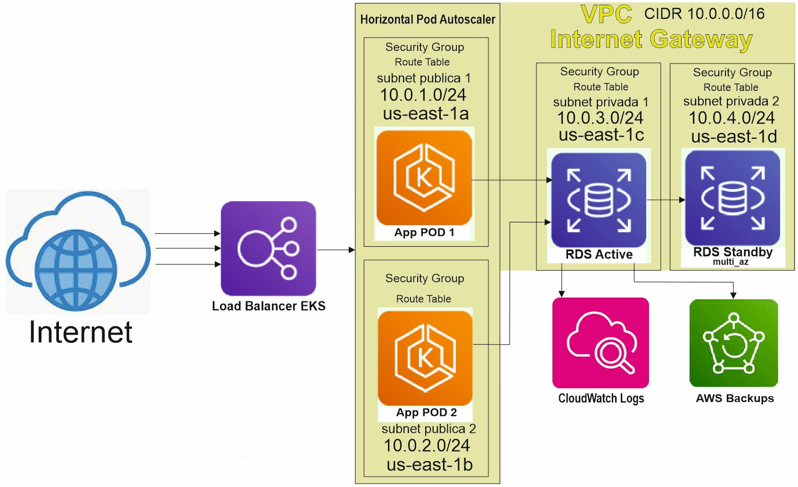

# Guía de Usuario

Bienvenido a la guía de usuario. Aquí encontrarás cómo usar esta aplicación.

## Descripción

Este proyecto realiza un despliegue completo de infraestructura en AWS usando Terraform y Kubernetes, que sostiene una app que guarda sus datos en una base de datos relacional, guarda sus logs y tiene un backup de su información.
Cuenta con alta disponibilidad y respaldo ademas que escala automarticamente bajo demanda.

## Requisitos

1) Tener instalado Terraform
2) Tener instaldo AWS Cli
3) Haber modificado las credenciales AWS en la maquina local
4) Tener instalado PODMAN
5) Tener instaldo Kubectl

## Instalación

1) sudo dnf config-manager --add-repo https://rpm.releases.hashicorp.com/RHEL/hashicorp.repo
2) sudo dnf install -y terraform
3) wget "https://awscli.amazonaws.com/awscli-exe-linux-x86_64.zip"
4) unzip awscli-exe-linux-x86_64.zip
5) cd aws
6) sudo install ./install
7) aws configure (ingreso mis credenciales de aws)
8) sudo dnf install -y podman
9) wget https://dl.k8s.io/release/$(wget -qO- https://dl.k8s.io/release/stable.txt)/bin/linux/amd64/kubectl
10) chmod +x kubectl
11) sudo mv kubectl /usr/local/bin/
12) Clona el repositorio: git clone https://github.com/snicolasg/Obligatorio-Cloud-2025.git

## Uso

1) Navega al directorio: cd Obligatorio-Cloud-2025
2) Ejecutar el scripts: bash despliega.sh

## Diagrama de infraestructura

## Descripción de los Componentes y su Uso 

1. Load Balancer EKS 

Recibe tráfico desde Internet y lo redistribuye hacia la aplicación. 

2. Horizontal POD Autoscaler 

Escala automáticamente bajo demanda los pods que forman parte del clúster EKS para asegurar alta disponibilidad de la aplicación. 

3. VPC 10.0.0.0/16 con cuatro Subredes publicas 10.0.1.0/24 10.0.2.0/24 y las privadas 10.0.3.0/24 y 10.0.4.0/24

Dos Subnets Públicas: Contienen los pods de aplicación en principio cuando la demanda es baja solo un pod por subnet, estas reciben tráfico del Load Balance EKS.

Dos Subnets Privadas: Una contiene el pod con la base de datos principal, la otra contiene el pod con la réplica de la base de datos. Están aisladas del acceso directo desde Internet. 

4. Internet Gateway 

Permite el acceso hacia internet a los pods con la aplicación. 

5. Route Table 

Creamos dos route table una para las subnets públicas que es donde se permite el tráfico a internet y la otra está asociada a las privadas. 

6. Amazon EKS 

Orquesta los pods que contienen los contenedores que a su vez ejecutan la aplicación y la base de datos. 

7. Base de datos (RDS MultiAz)

Usamos una base de datos relacional My-Sql con MultiAz.

8. Amazon AWS Backups 

Backup de la base de datos. 

9. Amazon CloudWatch Logs 

Se almacenan los logs de la base de  datos.

10. Security Group (SG) 

Lo usamos para controlar que el tráfico proveniente de Internet solo sea permitido hacia a nuestra aplicación vía HTTP y HTTPS en los puertos 80 y 443.  Tambien un SG que permite trafico de ingreso 
al puerto 3306 de la base de datos.
